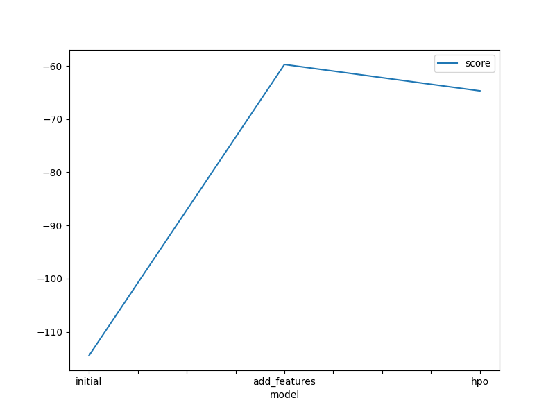
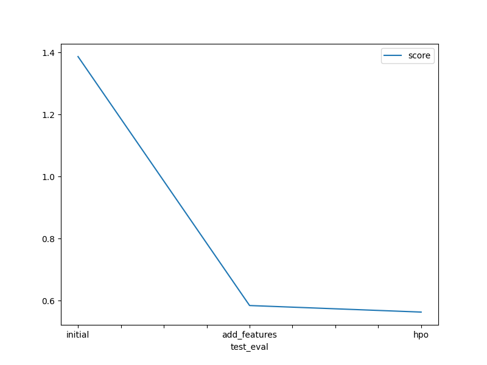

# Report: Predict Bike Sharing Demand with AutoGluon Solution
George Mejia

## Initial Training
### What did you realize when you tried to submit your predictions? What changes were needed to the output of the predictor to submit your results?

I have to remove zeros from results because of kaggle restrictions.

### What was the top ranked model that performed?
WeightedEnsemble_L3 definitely, optimized with hyperparameters.

## Exploratory data analysis and feature creation
### What did the exploratory analysis find and how did you add additional features?

- Datetime seems to has a lot of information but it's accumulated, I should definitely split up into year, month, day and take a look again.
- People usually rides on spring season.
- Season is not giving useful information, maybe it is kind of noise.
- People usually ride on weekday.

### How much better did your model preform after adding additional features and why do you think that is?
With more time, I would look at correlation between features and modify the datasets if if necessary.

## Hyper parameter tuning
### How much better did your model preform after trying different hyper parameters?
A little better but I was expecting higher results. I was disappointing I don't know all parameters for hypertuning 

### If you were given more time with this dataset, where do you think you would spend more time?
I would spend 60% of time adding more features and remove other unuseful features (feature engineering) and the other 40% would be for hypertuning because I see a lot of información about it.

### Create a table with the models you ran, the hyperparameters modified, and the kaggle score.
|model|hpo1|hpo2|hpo3|score|
|--|--|--|--|--|
|initial|?|?|?|?|
|add_features|?|?|?|?|
|hpo|?|?|?|?|

### Create a line plot showing the top model score for the three (or more) training runs during the project.

TODO: Replace the image below with your own.

### Create a line plot showing the top kaggle score for the three (or more) prediction submissions during the project.

TODO: Replace the image below with your own.

## Summary

This project is about solving a machine learning problem of predicting bike sharing demand which has a high impact on people lives as a services, so we got a dataset from kaggle and analyze outcomes and improvements in order to train a model effectively, we build the model and compare with previous results in order to make changes for improvements (using feature engineering and hypertunig), we put ML lifecycle in practice to solve a real world problem.
